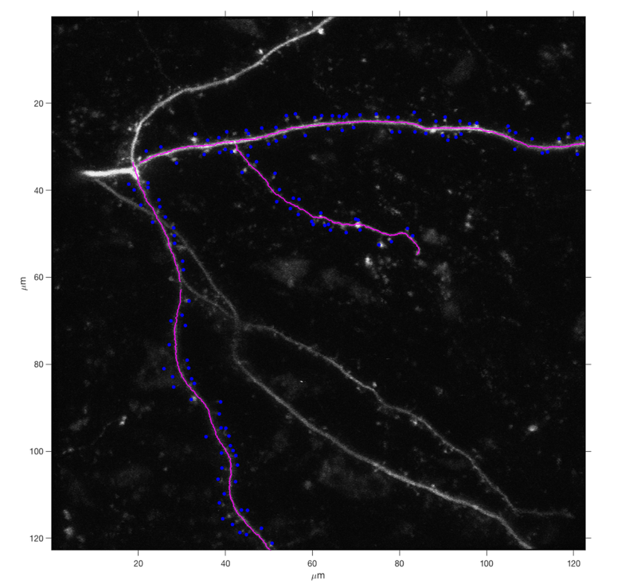
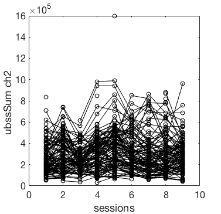
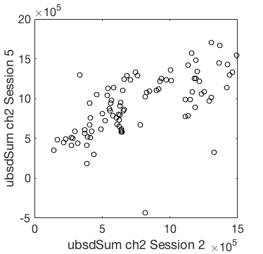

## MapManager-Matlab

[Map Manager][5] is a program to annotate 3D image time-series. It provides a rich user-interface to create, curate, and visualize 3D annotations. Map Manager is written in Igor Pro and conveniently saves all annotations as plain text.



Here, we provide a Matlab toolbox to load, visualize, and extend Map Manager annotations created with the Igor Pro version.

We also have a Python package [PyMapManager][3], please see the Python [API][4]. 

## Getting started
 
 - Download the [latest release][1]
 - Extract the .zip file
 - See examples in **/examples/mmExamples.m**
 - See the [documentation][2]

## Classes

 - mmMap - A Map Manager map
 - mmStack - A Map Manager stack
 - mmPlot - Utility class to plot mmMap and mmStack objects.

## Examples

#### Load a map and plot a stat

```matlab
% Load a Map Manager map
mapPath = 'd:/Users/cudmore/MapManagerData/rr30a';
myMap = mmMap(mapPath);

% Set up a plot struct and get map values to plot
ps = mmMap.defaultPlotStruct();
ps.stat = 'ubssSum'; % background subtracted spine sum
ps.channel = 2;
ps = myMap.GetMapValues(ps);

% Make a plot
mmPlot.plotStat(myMap, ps);
```


	
#### Plot a stat at different time-points (Sessions)

```matlab
% To see how a stat changes over time
% plot values at different sessions
xps = mmMap.defaultPlotStruct();
xps.stat = 'ubsdSum'; % background subtracted dendrite sum
xps.channel = 2;
xps.session = 2;

yps = xps;
yps.session = 5;

mmPlot.plotStat2(myMap, xps, yps);
```



## All classes have Matlab help

### help mmMap
```
 mmMap - A class to load, extract, and analyze annotations in a Map Manager map.
 
 To construct a mmMap object:
     myMap = mmMap(mapPath)
 
 To get a default plot struct
     ps = mmMap.defaultPlotStruct()
 
 mmMap Properties:
     mapName - Name of the map, same as enclosing folder name
     mapPath - Path to map folder used in constructor
     numChannels - Number of color channels in each stack
     numSessions - Number of sessions in the map
     numMapSegments - Number of segments in the map
     mapNV -  Text table of map, rows are labelled with names, columns are sessions
     stacks - Array of mmStack
 
 Extract Annotations:
     GetMapValues(ps) - Get values of annotations from a map
     GetMapDynamics(ps) - Get the dynamics (add, subtract, etc.) of each annotation.
 
 Utility:
     find(stat, findstr) - find annotations with notes, errors, and warnings
     GetValue_NV(name, session) - Get value from a session in a map
     getValidStats() - Return a cell array of valid stat names
     isValidStat(stat) - Check if a stat is valid
 
 Add new annotations:
     addUserStat(newStatName,newStatValues) - Add a new stat to a map
     save() - Save user stats. Please see help for important information.
 
 Plotting:
     plot0 - Plot a canonical map manager map of spine position versus session.
     plotStat - Plot values of a stat versus sessions or days.
     plotStat2 - Plot a stat (or two different stat) for two different session.
     plotMaxProject - Plot the maximal intensity projection of a stack overlaid with tracing and annotations.
```
### help mmStack

```
 mmStack - A class to load, extract, and analyze annotations in a Map Manager stack.
 
 To construct a mmStack:
    myStack = mmStack(tiffPath)
 
 mmStack Properties:
    stackName (str) :
    tiffPath (str) :
    inMap (boolean) : True if stack is inserted into a mmMap, false otherwise.
    stackdb (table of str) : table of annotations, one row per annotation
    int1 (table of float) : table of intensity values for each annotations
    int2 (table of float) :
    int3 (table of float) :
    userstat (table of float) : table of user created annotation values
    linedb (table of float) : table of all segment tracings in the stack
 
 Annotations:
    getStackValues - Get annotation from stack
    addUserStat - 
 
 Tracing:
    getTracing - Get one or all segment tracings
 
 Images:
    loadStack - Load the image stack
    unloadStack - Unload the image stack
 
 Utility
    find - find annotations by their note stat
    save - save user annotations added with addUserStat
```

### help mmPlot
```
 mmPlot  - A class to plot mmMap annotations, tracings, and images
 
 Static methods
    mmPlot.mapPlot0 - Cannonical map manager map plot of pDist versus session
    mmPlot.plotStat - Plot a map stat versus session or days
    mmPlot.plotStat2 - Plot two stats, y versus x
    mmPlot.mapPlotCondition - Plot a stat versus sessions only for sessions in a list
```

[1]: https://github.com/cudmore/MapManager-Matlab/releases
[2]: http://htmlpreview.github.io/?https://github.com/cudmore/MapManager-Matlab/blob/master/docs/mmExamples.html
[3]: https://github.com/cudmore/PyMapManager
[4]: http://blog.cudmore.io/PyMapManager/
[5]: http://blog.cudmore.io/mapmanager/
